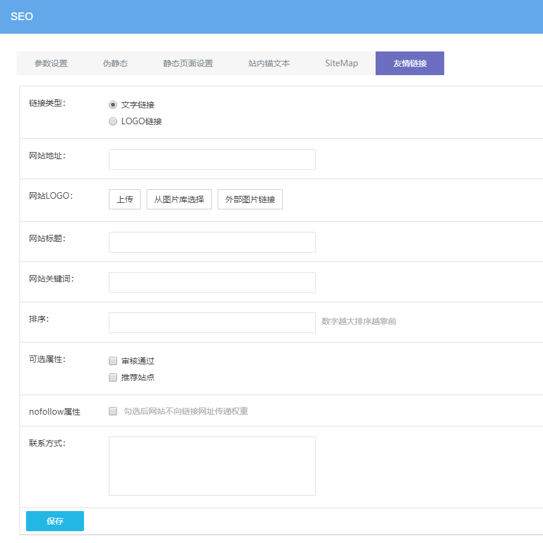

# 友情链接管理

友情链接是指互相在自己的网站上放置对方网站的 LOGO 图片或文字的网站名称，并能点击链接到对方网站上，使得用户可以从合作网站中发现自己的网站，达到互相推广的目的，是一种基本的网站推广方式。

点击网站可视化编辑后台 — SEO — 友情链接 — 添加内容

**链接类型：**分文字和 LOGO 两种，LOGO 链接需上传 LOGO 图片。

**网站网址：**点击友情链接链接到的网址。

**网站 LOGO ：**当链接类型为 LOGO 链接时需上传 LOGO （建议尺寸：135px 45px）。

**网站标题：**当链接类型为文字链接时设置显示在网站上的网站标题。

**网站关键词：**鼠标浮动在网站标题上显示的描述信息。

**排序：**数字越大排序越靠前。

**可选属性：**审核通过后才能够在网站前台友情链接区块显示，推荐站点后排序会在最前方（多个推荐时再会根据排序值来判断）。

**nofollow属性：**是否传递权重，勾选后网站不向链接网址传递权重。

**联系方式：**添加沟通交换友情链接对方工作人员联系方式，方便后期维护。