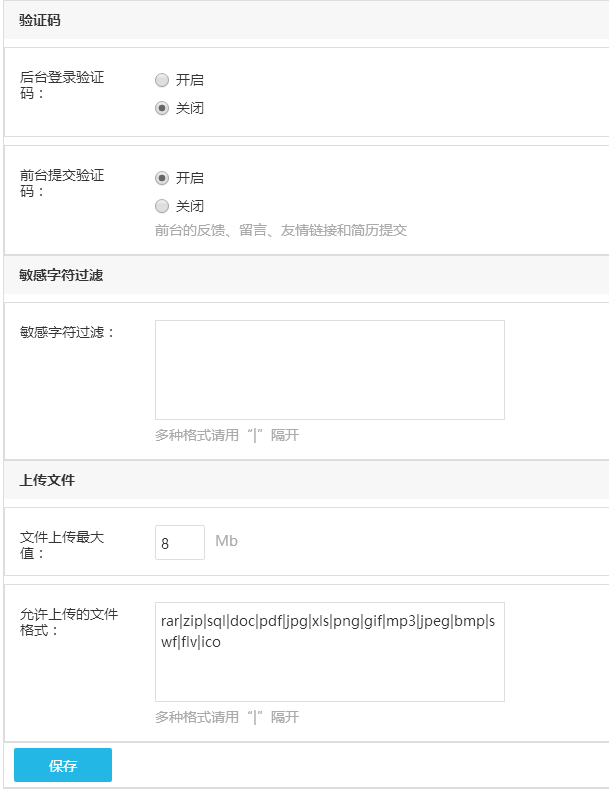

# 安全与效率

系统针对于网站安全这块，有专门的设置选项，例如自动更新补丁，修复漏洞，设置网站后台管理员登陆地址，开启验证码等，可提高网站的安全性。

**自动重命名：**对网站上上传的图片，文件等重命名，有利于减少网站异常，常见的因为空间编码格式导致中文命名的图片不显示，所以建议勾选此设置。

**漏洞自动修复：**官方发布漏洞修复补丁后，程序自动下载并修复，建议开启，提高网站安全性。

**删除升级文件：**网站升级后，下载的升级文件不会自动删除，建议删除，可以增强网站的安全性能。

**删除安装文件：**系统安装后，安装文件为多余文件，除非操作网站搬家，或重装网站，否则不会用到。

**后台文件夹名称：**网站后台登录地址结构为：「网站网址/后台文件夹名称」，所以后台文件夹名称对于网站的安全性能是非常关键的设置，默认为 admin，不支持中文，建议不要包含网址。

**后台登录验证码：**登录后台管理员账号时显示。

**前台提交验证码：**前台的反馈、留言和简历提交时填写，减少提交垃圾信息。

**敏感字符过滤：**过滤前台反馈、留言和简历提交时包含的敏感文字信息，多个文字用 “|” 隔开。

**文件上传最大值：**设置网站上传文件最大值限制，此处设置的数值不能超过服务器php.ini中设置upload_max_filesize的最大值（一般默认值为2M），否则无效，如需修 改 php.ini 中的设置，需要联系空间服务商操作。

**允许上传的文件格式：**管理允许上传的文件类型，如果有需要添加其他的类型，直接用 “|” 隔开，添加即可。