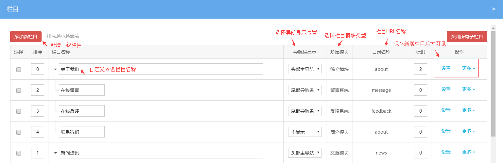

# 栏目策划与设置

网站栏目是整个网站的基本框架，它决定了用户是否可以通过网站方便地获取信息，也决定了搜索引擎是否可以顺利地为网站的每个网页建立索引,对网络推广运营发挥了至关重要的作用。

网站栏目结构要求做到简单、层次清晰、分类明确。

网站栏目结构层次最多不超过三级，如关于我们是一级栏目，其下面的企业文化是二级栏目，还可以为该栏目设置一个下属子栏目，总共三级栏目结构。可以根据此栏目结构图做好栏目归类，也可以根据企业的具体情况进行调整。

**配置网站栏目**

**1、如何新增一级栏目？**

点击可视化编辑后台—栏目—添加新栏目。

根据已经策划好的网站栏目，对应的添加设置好栏目布局：添加好一级栏目，选择对应的栏目属性，设置好对应的目录名称，保存之后，再对一级栏目点击更多去操作添加子栏目。

添加栏目时，所属模块和目录名称是不能修改的，目录名称是前台对应栏目的访问目录，对 URL 构成有影响。

**2、如何新增子栏目？**

点击可视化编辑后台—栏目—点击需要添加子栏目对应的更多操作，点击添加。

无其他特殊需求，建议子栏目跟上一级栏目的所属模块一致，方便管理和展示。

**3、移动栏目**

点击可视化编辑后台—栏目—点击需要操作的栏目对应的更多操作—点击移动。

可以选择移动到其他哪个栏目下，或者移出为一级栏目（移动一级栏目，子栏目也会被一起移动）。

**4、删除栏目**

点击可视化编辑后台—栏目—选择好需要删除的栏目—点击下方的删除按钮即可删除，或者单独点击对应栏目的更多操作中的删除

**删除栏目后，对应栏目下的内容也会一起删除，请慎重操作**。

**5、复制栏目**

点击可视化编辑后台—栏目—选择好需要复制的栏目—点击右下方—选择复制到哪个语言，是否复制内容，点击复制按钮即可删除（如果其他语言中已存在相同目录名称的栏目，则无法复制成功）。

