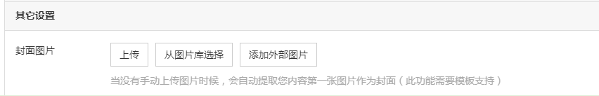

# 添加内容

系统可视化编辑中的——内容——添加内容设置，可以快速发布内容到指定栏目

此功能只对文章模块、产品模块、图片模块、招聘模块、下载模块有效，其它栏目模块，需要到内容——内容管理中，找到对应的栏目模块添加内容。

选择添加的栏目后点击下一步，进入内容发布操作界面，如果还没有创建栏目，则可以点击配置栏目添加新的栏目模块。

**内容编辑页面，主要包含基本信息、参数、详细内容、SEO优化、其他设置等设置，接下来给大家一一介绍：**

**1、基本信息**

**选择栏目：**选择需要发布在哪个栏目下，产品模块可选择发布在多个栏目下选手，按住ctrl键即可选择多个栏目。

**设置标题：** 自定义设置内容标题。

**添加展示图片：**产品和图片模块才有，可以添加多张图片，支持添加外部图片。

### **2、参数设置**

产品模块、图片模块和下载模块才有，点击参数管理，添加更多参数，添加后，点击刷新，即可看到添加的参数和设置参数值。

系统版本产品模块新增链接字段类型参数

前台展示效果

在线询价按钮在反馈模块中设置。

**3、详细内容**

使用百度编辑，通过头部功能区灵活编辑排版内容，仅产品模块支持添加多个详细内容编辑，最多5个

****

**4、SEO优化**

页面SEO相关参数设置

**自定义页面title：**建议为空，采用SEO—参数设置中设置的title构成方式。

**关键词：**为空则采用SEO—关键词设置中的网站关键词，建议添加与文章内容相关的又是网站的长尾关键词。

**描述文字：**页面描述内容，最多不超过200字，高度概括文章主要内容，为空则自动获取详细内容中的文字。

**TAG标签：**站内优化功能，方便用户最快找到自己感兴趣的其他文章，最好设置为与文章内容相关的又是网站的长尾关键词，控制在3个左右。

**静态页面名称：**为空则采用SEO-静态页面设置中的静态页面名称规则，需开启整站静态后才有效，则页面的URL为「设置的静态页面名称.html」。

**5、其它设置**

不同模块的其他设置不同，简介模块没有其他设置

- **产品模块**

**访问量：**可以设置一个初始值，默认是 0 ，用户点击查看后，数值会自动增加，列表页排序方式之一。

**链接至：**添加后，在列表页点击查看不会进入详情页，而是直接跳转到设置的网址。

**访问权限：**设置栏目的访问权限，需结合会员功能，可以选择哪个会员组可访问或者不限制。

**状态：**1、前台显示：网站前台所属栏目下，是否显示此内容；2、推荐、置顶：用于列表页排序，置顶的优先级高于推荐，在列表页的最前方显示。

**更新时间：**自动获取保存时的当前时间，也可以自定义修改时间，列表页排序方式之一。

**发布时间：**立即发布前台即可显示；定时发布，可以设置发布时间，列表页排序方式之一。

- **文章模块**

上传封面，此功能需要模板支持

当没有手动上传图片时候，会自动提取您内容第一张图片作为封面，如果都没有图片，则用系统默认图片显示，如图

- **下载模块**

上传提供下载的文件或文档，显示文件路径和大小

