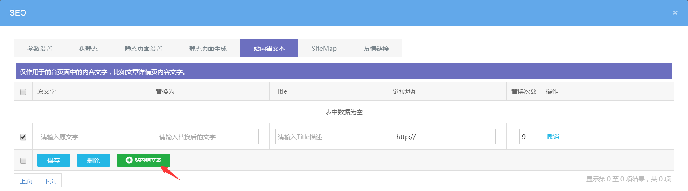

# 站内锚文本设置

## **站内锚文本的作用**

- 引导浏览、提升用户体验。
- 引导蜘蛛爬行、提高文章收录率。
- 提升整站权重 有了合理的内链，整个网站就像是一张网，权重都是合理分配的。
- 站内锚文本不仅可以提升关键词的排名，还可以提升文章的收录率以及整个网站的权重等等。

## **如何添加站内锚文本**

点击可视化编辑后台 — SEO — 站内锚文本，仅作用于前台页面中的内容文字，比如文章详情页内容文字

**原文字：**网站后台编辑的内容。

**替换为：**替换原文字，前台真正显示的内容(为空则默认为原文字)。

**Title：**鼠标浮在文字上时，显示的信息。

**链接地址：**点击锚文本文字 链接到的目标地址。

**替换次数：**同一页面出现多个原文字时，设置几个生效。