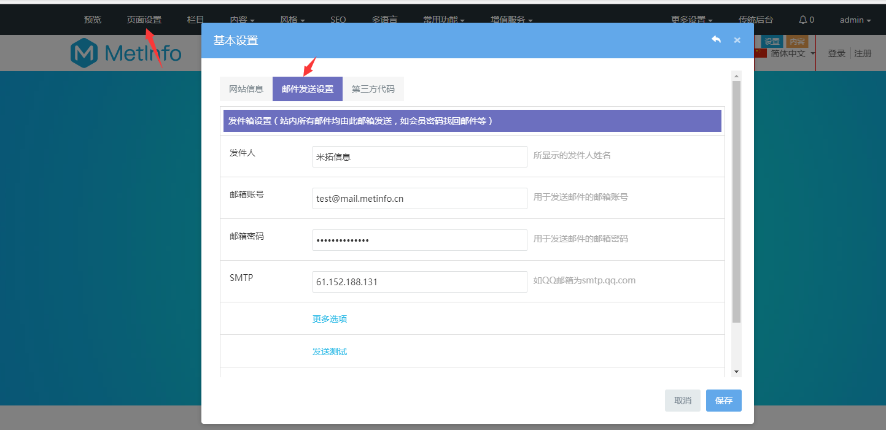
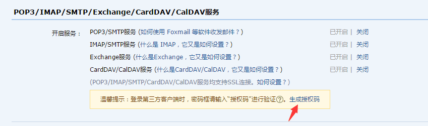

# 网站发件箱设置

网站邮箱主要是作为网站自动发送邮件中的发件箱。网站上所有自动发送邮件均有此邮箱发送。主要包括会员注册反馈邮件、留言模块反馈邮件、反馈模块反馈邮件、招聘模块反馈邮件。

点击可视化编辑后台 — 网站首页 — 页面设置，即可设置（或点击更多设置 — 系统邮箱设置）。

**发件人：**发送出去的邮件中显示的发送人姓名，一般为公司名称；

**邮箱账号：**填写用于发送邮件的账号；

**邮箱密码：**填写邮箱密码 （注意：QQ邮箱需要填写授权码）；

到邮箱设置中开启SMTP服务和设置生成授权码；

**邮件SMTP服务器：**

附录：常见邮箱smtp服务器地址：

| 邮箱smtp地址                         | 邮箱smtp地址                    |
| ------------------------------------ | ------------------------------- |
| QQ邮箱：smtp.qq.com                  | QQ企业邮箱： smtp.exmail.qq.com |
| 163.com: smtp.163.com                | sina.com: smtp.sina.com.cn      |
| gmail(google.com)： smtp.gmail.com   | HotMail：smtp.live.com          |
| 126邮箱：smtp.126.com                | 139邮箱：smtp.139.com<          |
| 21cn.com: smtp.21cn.com              | etang.com: smtp.etang.com       |
| tom.com: smtp.tom.com                | x263.net: smtp.x263.net         |
| yahoo.com.cn: smtp.mail.yahoo.com.cn | 263.net: smtp.263.net           |
| Foxmail：smtp.foxmail.com            | sinaVIP：smtp.vip.sina.com      |
| sohu.com: smtp.sohu.com              | china.com： smtp.china.com      |

如不清楚smtp服务器地址或其他信息，可向邮箱提供商询问。

**更多选项设置：**

设置发送端口和发送方式

选择不同的发送方式时，填写对应的端口号；
信息输入确认无误之后，点击测试，正常的情况会提示：邮箱设置正确！

**如果提示：“错误提示：测试发送邮件失败！解决办法：请检查帐号密码和smtp是否有误或查看邮箱是否开启smtp服务。”就说明您输入的邮箱信息有误，需要输入正确的信息。**