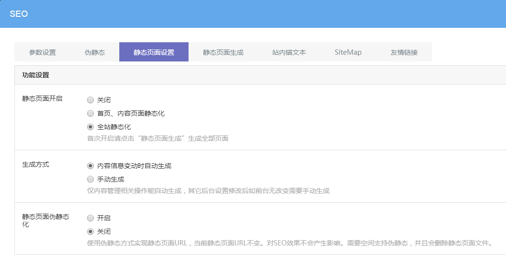
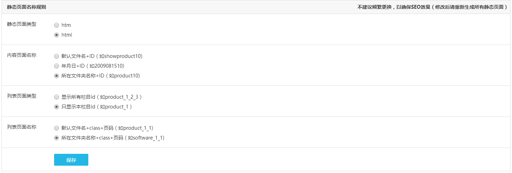

# 静态页面设置

开启静态页面后，会在服务器生成对应的.html页面文件，会占用空间容量，且每次更新维护都会重新生成静态页面，不利于网站管理，从SEO优化角度看，目前的搜索引擎在这方面已经没有什么太大的区别了，也可以用伪静态代替，所以如果没有特殊要求，不建议开启静态。

系统支持开启伪静态或静态页面，但二者不能同时开启，优先建议选择开启伪静态，如果需要开启静态页面，可到可视化编辑后台 — SEO — 静态页面设置中设置。

## **静态页面开启**

可以设置局部开启静态，或者全站静态化，开启后需要点击「静态页面生成」，生成全部页面。
**（注意：静态页面和伪静态不能同时开启，只能选择一种方式）**

## **生成方式**

内容信息自动生成方式只对内容—内容管理中的相关操作有效；选择手动生成，则每次更新网站内容后，前台不会有改变，需要点击静态页面生成，生成对应的栏目模块。

建议选择内容自动生成，其他设置前台没有生效时，再手动生成对应栏目，方便管理网站。

## **静态页面伪静态化**

对于一直开启静态页面的网站，需要开启伪静态，则点击设置开启静态页面伪静态化，使用伪静态方式实现静态页面。

## **静态页面命名规则**

开启静态页面后，页面URL构成方式，建议采用默认设置

 