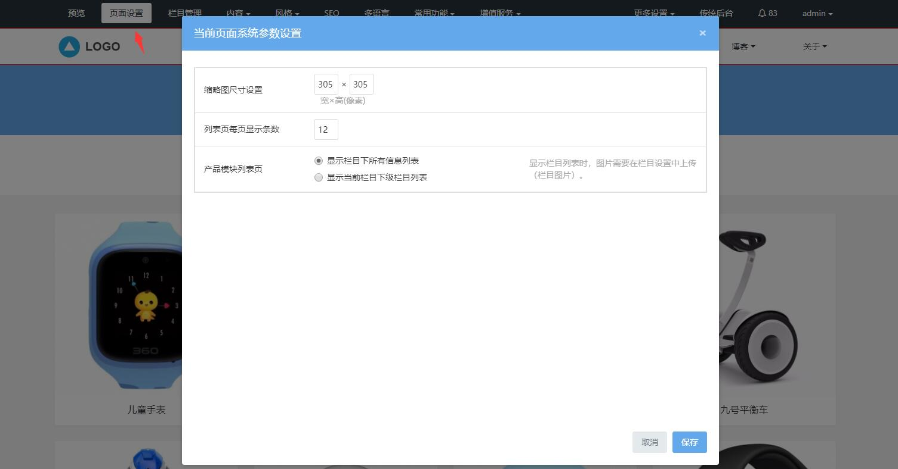

# 5、专家页修改

**一、专家名录设置**

点击所属模块是产品模块的栏目（可通过栏目管理添加），进入的是产品列表页，产品列表页展示的是产品模块下的内容列表，产品图片，标题等。

**1、快速修改列表页内容**

图片和文字信息，都可以直接可视化修改，鼠标放在需要修改的地方，可直接点击可视化修改图标，即可修改替换成自己的内容。

**设置：**修改区块的展示样式，区块开关、风格色调等，不同模板的产品列表页点击设置的功能是不一样的，具体以当前模板的设置为准。

**内容：**点击内容按钮，进入的是当前栏目模块的内容管理界面，可添加发布更多内容，或编辑，删除当前内容，具体可参考内容管理。

**2、列表页页面设置**

可视化编辑功能区块的页面设置按钮，不同的模块的页面设置是不一样的，产品列表页的页面设置，可设置当前产品列表页产品缩略图尺寸 ，每页显示的产品数量以及展示方式（内容列表还是子栏目列表）。

**二、详情设置**

点击产品列表页的单个列表，可进入详情，展示的是详细信息。

设置：修改区块的展示样式，区块开关、风格色调等，不同模板的产品详情页设置的功能是不一样的，具体以当前模板的设置为准。

内容：点击内容按钮，进入的是当前产品的内容编辑页面，可编辑修改当前产品详细信息，具体可参考添加内容。
