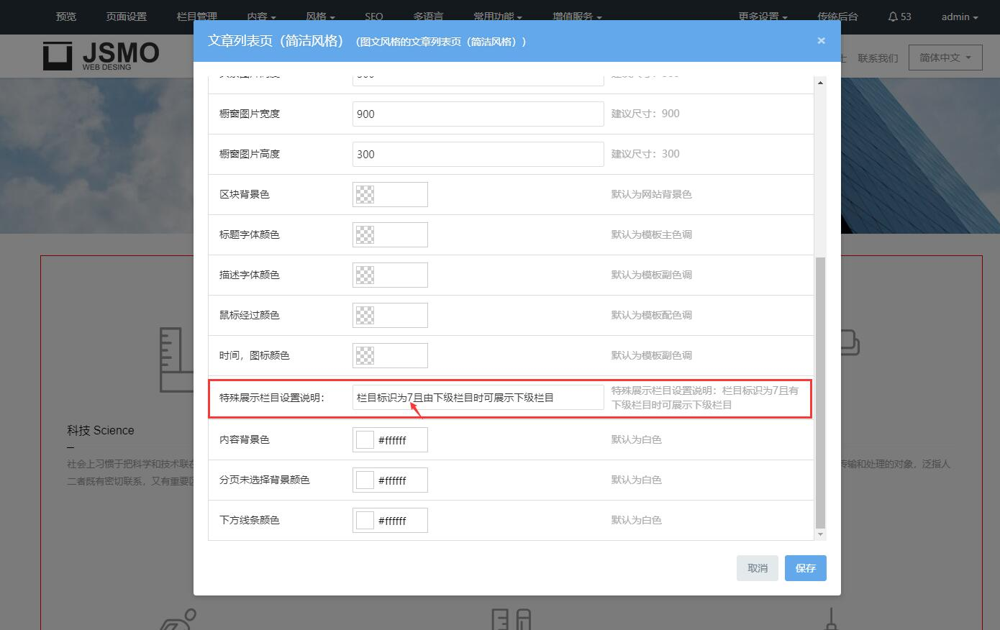

# 2、栏目管理

**一、栏目规划及网站整体布局**

网站栏目是整个网站的基本框架，它决定了用户是否可以通过网站方便地获取信息，也决定了搜索引擎是否可以顺利地为网站的每个网页建立索引，对网络推广运营发挥了至关重要的作用。

网站栏目结构要求做到简单、层次清晰、分类明确。一般来言，网站栏目结构层次最多不超过三级，如关于我们是一级栏目，其下面的企业文化是二级栏目，还可以为该栏目设置一个下属子栏目，总共三级栏目结构。大部分企业的栏目的设置都是如下图所示，数据配置时可以根据所属行业的实际情况进行调整；

**二、如何****创建网站栏目**

进入网站可视化后台——点击栏目管理——新增栏目。

根据已经策划好的网站栏目，对应的添加设置好栏目布局：添加好一级栏目，选择对应的栏目属性，设置好对应的目录名称，保存之后，再对一级栏目点击更多去操作添加子栏目。

**导航栏目显示：**设置是否在头部或底部导航显示。

**所属模块：**

根据栏目性质选择合适的模块，系统内置各个功能模块，如文章模块、产品模块，可以理解为不同功能的前台页面，每个模块的显示特征也是不一样的，用户可以根据自己的需求来设置栏目功能。

请注意：栏目设定模块后是不允许修改的，所有请先规划好栏目和模块再进行配置。

- 简介模块：相当于单页，前台页面点击该模块栏目后直接显示内容，如：公司简介。
- 文章模块：用于发布文章，前台页面点击该模块栏目后先显示文章列表，点击具体文章后，显示文章内容。
- 产品模块：用于添加产品，前台页面点击该模块栏目后先显示产品图片列表，点击具体产品后，显示产品介绍页面。
- 下载模块：提供资料文档，前台页面点击该模块栏目后先显示下载列表，点击具体资料文档后，显示资料文档介绍页面，并提供下载链接。
- 图片模块：用于添加展示图片，如案例展示，前台页面点击该模块栏目后先显示图片列表，点击具体图片后，显示相应内容和介绍。
- 反馈系统：用于添加表单，点击栏目后直接显示表单，一般用于在线报名或产品订购。
- 外部模块：指定一个链接的网址，该模块栏目点击后会直接跳转到指定的网址。

以上模块栏目允许出现多个，以下模块栏目只能存在一个：

- 招聘系统：用于添加招聘信息，前台页面点击该模块栏目后先显示招聘的职位列表，点击具体职位后，显示职位相关说明以及在线应聘。
- 留言系统：用于访客提交留言和查看留言板，前台页面点击该模块栏目后显示留言板（管理员在后台审核通过的留言将显示在留言板）以及留言提交表单。
- 会员中心：添加后网站的会员功能才能生效。
- 全站搜索：一般把该栏目放在页面尾部导航，便于访客查询所需资料。
- 网站地图：该栏目页面显示网站的所有栏目结构以及栏目链接。

**目录名称：**目录名称设置好后是不能修改的，目录名称是前台对应栏目的访问目录，对 URL 构成有影响。

**标识：**有些模板区块需要添加栏目标识，只有设置了标识才能展示该区块特殊的样式，具体按模板区块设置中的配置说明中对应区块的标识要求来设置。例如mui005的新闻列表页就是需要设置标识7才能展示特殊展示效果。

**设置：**栏目的设置包含基本信息、SEO搜索引擎优化设置、其它设置（根据模板配置说明设置）以及权限设置，不同栏目模块的设置选项略有不同。

**更多：**更多设置，可添加子栏目、移动栏目（移动到其它的栏目下或者升级为一级栏目）或删除当前栏目。

