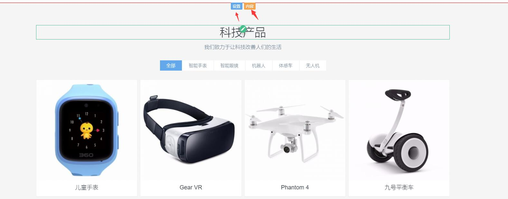
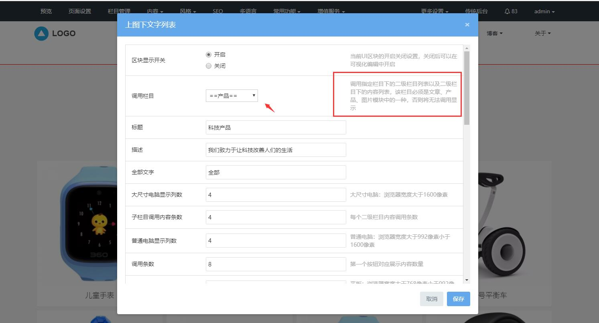
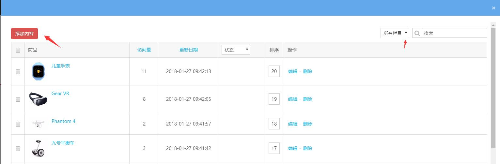

# 8、首页区块设置

网站首页区块基本上是选择网站栏目，自动显示栏目下的内容，所以等网站栏目和网站页面内容编辑完成后，最后我们再修改首页区块设置。

不同模板的首页区块是不一样的，但设置是相通的，主要有以下几种类型：1、直接点击区块的设置编辑内容、2、调用栏目下的内容列表或子栏目列表展示，具体可点击首页区块的对应的设置查看到。

点击首页区块的设置按钮，可设置当前区块调用的栏目和内容，如果需要添加更多内容，则设置调用的栏目后，再点击区块的内容按钮，即可添加更多的栏目或内容列表信息。

以mui001模板为例，首页的「科技产品」区块，则是显示子栏目及子栏目下的内容列表，点击区块的设置，可查看到调用栏目设置的配置说明，那么在调用栏目时，则需要选择有子栏目且是内容列表的栏目模块（新闻，产品，图片等模块）。

调用栏目设置好后，再点击区块的内容按钮，可发布新的内容到对应的栏目模块下，或编辑删除栏目下的内容，具体可参考产品页设置。

