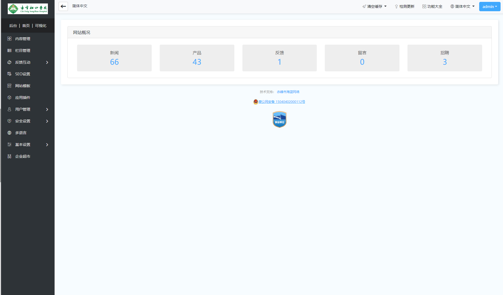

# 1、可视化编辑

系统采用可视化编辑，无需切换网站前后台，仅通过直观的操作方式即可完成网站编辑工作，想改哪里点哪里，让建站更简单、更容易。

接下来的教程是以可视化编辑功能设置为导向进行介绍，在介绍前，我们先来简单了解下可视化编辑功能按钮

**1、预览**

点击预览，可以直接访问当前页面的前台显示效果。

**2、页面设置**

当前页面的相关设置，例如图片缩略图尺寸、显示数量、产品选项卡等，进入不同模块页面，再点击页面设置，会出现对应的设置功能选项。

**3、栏目**

网站栏目管理功能，系统栏目按所属模块分类，可以分为：简介、文章、产品、下载、图片、反馈、留言、会员、友情链接、网站地图、全站搜索、招聘、外部模块等，根据具体的栏目类别来设置所属模块，最多支持添加三级子栏目。

**4、内容**

网站栏目添加好之后，点击内容，进入对应的栏目中管理和发布内容，高级操作教程。

- **添加内容**

点击内容—添加内容—选择需要发布的栏目—点击下一步，进入内容编辑页面，可快速发布内容到对应的栏目，只对文章模块、产品模块、图片模块、招聘模块、下载模块有效，其他模块内容添加需要到内容—内容管理中找到对应的栏目点击添加，

- **内容管理**

点击内容—内容管理—可根据模块或者栏目分类查看到网站上添加的所有的栏目模块，

并可以点击对应的栏目模块进去，发布新内容，或编辑管理已发布的内容

**5、风格**

- **风格设置：**设置当前模板风格相关色调，文字信息等。
- **模板选择：**切换和启用其他风格模板。
- **水印/缩略图：**缩略图设置和水印设置。
- **Banner管理：**网站轮播图片管理设置。

**6、SEO**

网站SEO搜索引擎相关设置，网站标题、关键词、伪静态、静态页面、站内锚文本、sitemap、友情链接设置。

**7、多语言**

添加和设置其他语言网站，不限制添加数量，且每种语言可以设置单独域名访问。

****

每种语言网站都可以单独管理，可以设置完全不同的内容和风格，点击导航上的多语言图标，进入对应的网站进行编辑管理。

****

**8、常用功能**

网站备份与恢复，网站系统升级检测，在线客服，会员管理功能、清空缓存。

**9、增值服务**

- **我的应用：** 已安装的应用插件，常用的网站体检，定期体检，维护网站安全。
- **官网商城：**应用商店，可以购买或安装其他需要的应用插件使用。
- **商业授权：**商业授权是软件开发者授权用户将软件用于商业用途的凭证（商业使用权利）
- **技术支持**：系统使用帮助文档。

**10、更多设置**

网站基本信息，安全与效率，图片水印，系统邮箱配置，第三方代码，导航菜单设置、系统功能大全。详细请参考高级教程

**11、传统后台**

点击切换到传统后台操作界面，也可点击传统后台的可视化，切换到可视化编辑后台。

