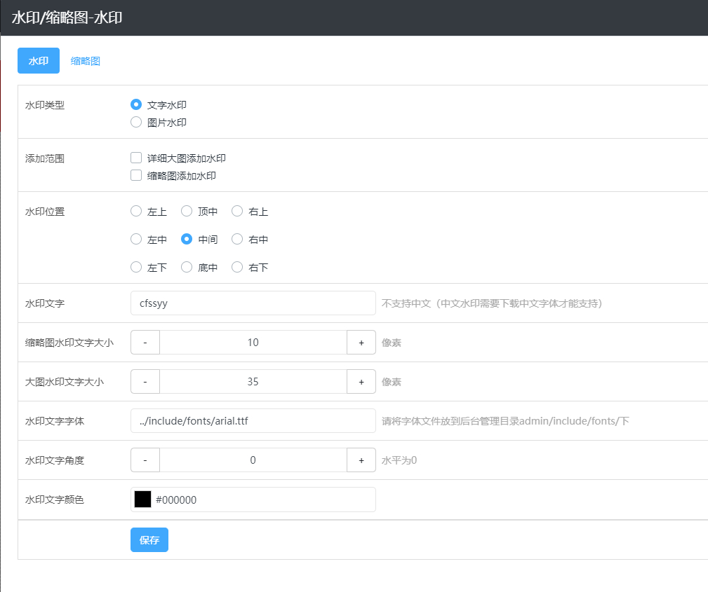

# 图片水印

可视化编辑后台 — 风格 — 图片水印中设置，可以添加文字或者图片两种类型水印；

## **1、文字水印设置**

**水印类型：**选择文字水印类型。

**添加方式：**选择添加水印的对象，详细大图或者缩略图。

**水印位置：**设置水印在图片上显示的位置。

**水印文字：**设置展示的水印文字内容，一般为公司名称简称；如果需要去除添加的文字水印，则此处把添加的内容删除，为空保存设置，再重新生成缩略图即可。

**文字大小：**分别设置缩略图和大图上水印文字的大小。

**水印文字字体：**填写字体文件路径 「../include/fonts/字体文件名称」， 默认为英文字体，如果需要添加其他字体，需把字体文件上传到「后台管理目录/include/fonts」下；（不能直接在后台上传，）。

## **2、图片水印设置**

**水印类型：**选择图片水印类型。

**添加方式：**选择添加水印的对象，详细大图或者缩略图。

**水印位置：**设置水印在图片上显示的位置。

**上传水印图片：**可以分别上传缩略图水印和大图水印图片，仅支持 .gif 和 .png 格式的图片，一般为公司 LOGO ；如果需要去除添加的图片水印，则此处把之前上传的水印图片删除，为空保存设置，再重新生成缩略图即可。

**注意：**水印设置好之后，只需点击可视化编辑中 — 常用功能 — 清空缓存，然后再重新访问页面即可重新生成带水印的缩略图。

## **3、如何去除水印**

网站添加了水印后，想要去除怎么办？

**文字水印：**其他设置跟添加水印时保持一致，只需把填写的水印文字删除，为空保存设置，重新生成缩略图即可。

**图片水印：**其他设置跟添加水印时保持一致，只需把上传的水印图片删除，为空保存设置，重新生成缩略图即可。

**注意：此去除水印的方法，只针对通过此方法生成的缩略图有效。**