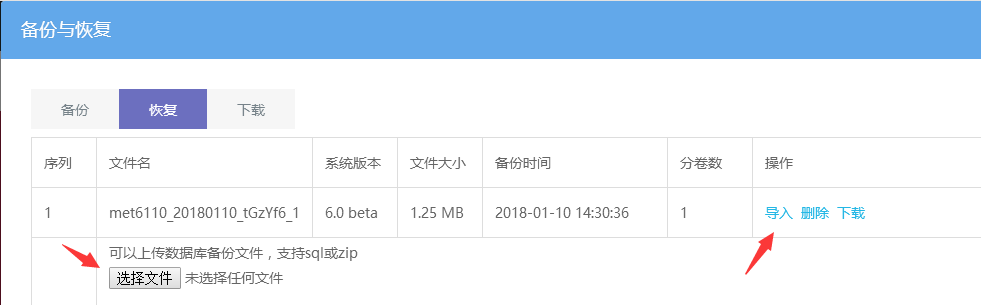
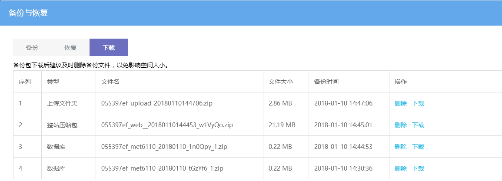

# 备份与恢复

网站备份与恢复，主要是为了更换空间服务器，移动网站或者网站被黑时，可以通过备份数据进行恢复。

点击可视化编辑后台 — 常用功能 — 备份与恢复中操作

## **一、网站备份**

建议首次搭建好网站并完善网站内容之后，进行备份一次，之后可以根据更新内容的量来合理安排是否需要操作备份，因为备份占用的空间容量比较大，建议下载到本地电脑保存，删除空间的备份。

**数据库备份：**网站数据内容备份，不含图片文件；也可以自定义选择数据表备份。

**上传文件夹备份：**备份的是upload目录文件，包含网站图片和上传的文档、视频等。

**全部备份：**即整站备份，包含以上两种备份数据，同时还包含程序文件备份以及模板文件，一般用于网站搬家 或者网站安全备份使用。

**整站备份文件在空间站点：**后台登录文件（默认admin）/databack/web 目录下。

## 二、恢复数据

导入网站备份中操作的数据库备份文件，支持上传.sql 或 .zip 格式文件，如果有多卷备份数据（备份时同一文件名，但为数不同，例如_1、_2等），则需要全部上传完，再点击导入按钮。

### **下载备份数据**

操作完备份后，可以到下载中下载备份文件，建议下载完后删除站点中的备份文件，以免影响空间大小。

- 序号1为上传文件夹备份后的备份文件。
- 序号2、3为操作全部备份后生成的备份文件，类型为整站压缩包中已包含了单独列出来的数据库文件（序号2中已有一份序号3的文件），所以直接下载类型为整站压缩包的文件即可。
- 序号4为操作数据库备份后生成的备份文件，如果数据库比较大，则会生成多条，主要看文件名是否相同。