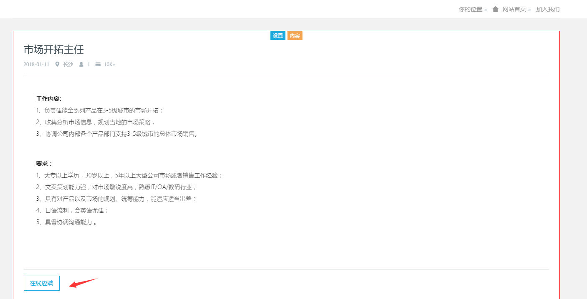
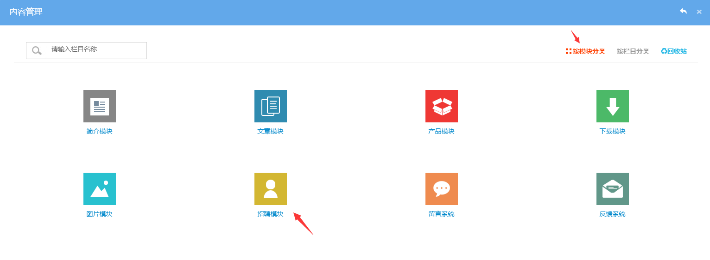
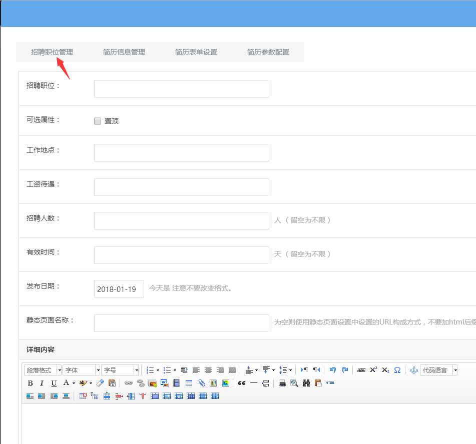
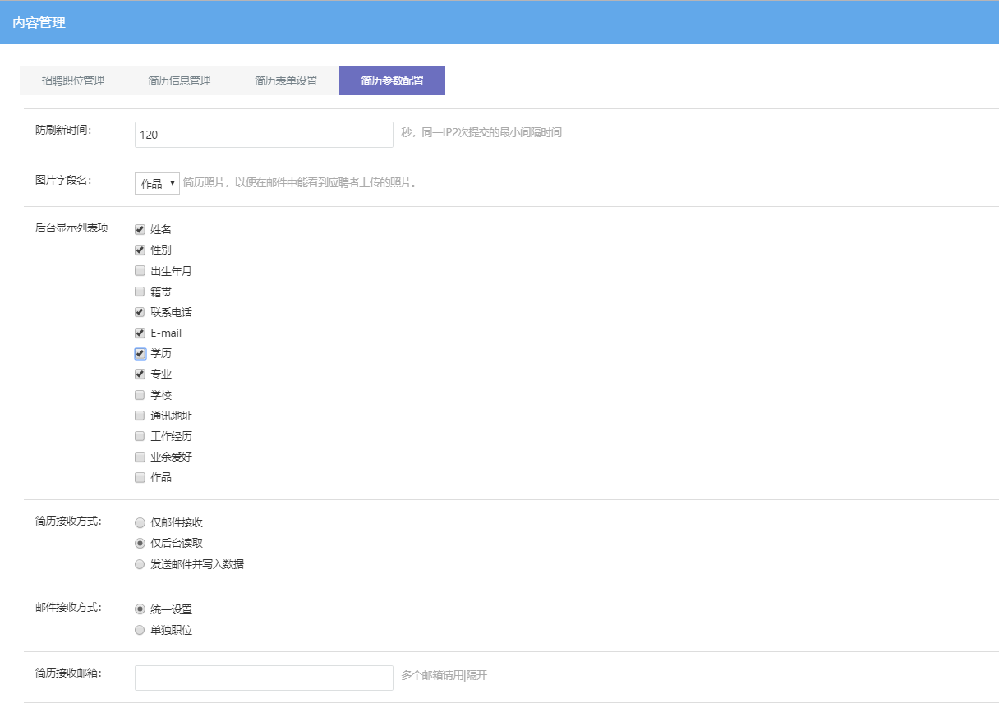

# 招聘模块管理

用于企业发布招聘信息，通过招聘广告，让用户更多的了解公司的岗位结构和实力，更能体现公司形象。

在可视化编辑后台 — 内容 — 内容管理 — 按模块分类可以查看到（前提是需要在栏目中添加招聘模块的栏目）

**1、招聘岗位发布**

点击招聘职位管理 — 添加内容：填写招聘职位，工作地点，工资待遇，招聘人数和岗位需求描述信息

## **2、简历表单设置**

设置前台提交简历信息的表单字段

**名称：**前台留言内容字段名称。

**字段类型：**根据填写的内容选择对应的字段类型。

**所属栏目：**一个语言站点，只能添加一个招聘模块，所以不需要设置。

**访问权限：**设置字段为会员可见或者哪个会员组可见。

**必填：** 设置字段是否必填，选择「是」后，前台必须填写才能提交表单。

**排序：**数值越小越靠前。

**操作：**字段类型为下拉、多选、单选类型时需要点击操作中的设置选项按钮，填写选项值，否则字段内容为空。

## **3、招聘模块参数设置**

**防刷新时间：**设置同一IP多次提交的间隔时间，减少恶意提交垃圾信息。

**图片字段名：**获取应聘者的照片，必须是“附件”类型字段。

**后台显示列表项：**设置简历表单字段是否在简历信息管理中查看。

**简历接收方式：** 三种接收简历方式，邮件、后台、邮件和后台。

**邮件接收方式：**统一设置方式，所有的简历都发送到统一的邮箱中；单独职位方式：可以实现每个岗位的简历发送到对应的邮箱中，选择单独职位方式后，在发布岗位招聘信息时，可以填写对应的接收简历的邮箱，且需要配置好网站发件箱功能。

**简历接收邮箱：**简历接收方式含邮箱时才有效，且需要配置好网站发件箱功能，填写好接收邮箱，才能接收到邮件。

**邮件回复设置：**需设置系统发件箱功能，勾选后，选择正确的邮箱字段，并设置好邮件标题和内容，应聘者提交简历后，系统会自动发送邮件给客应聘者。

## **4、简历信息管理**

应聘者提交的简历资料信息，接收方式含后台接收时，都会在此显示，便于网站管理员管理和查看。

