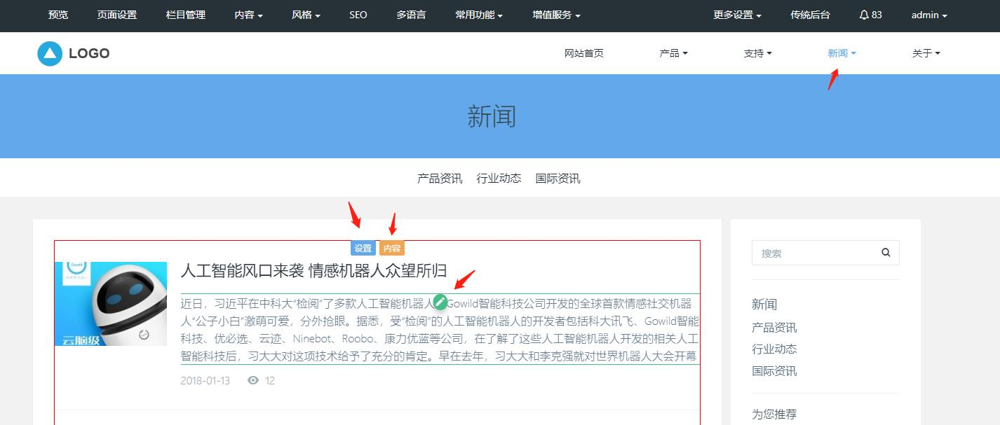
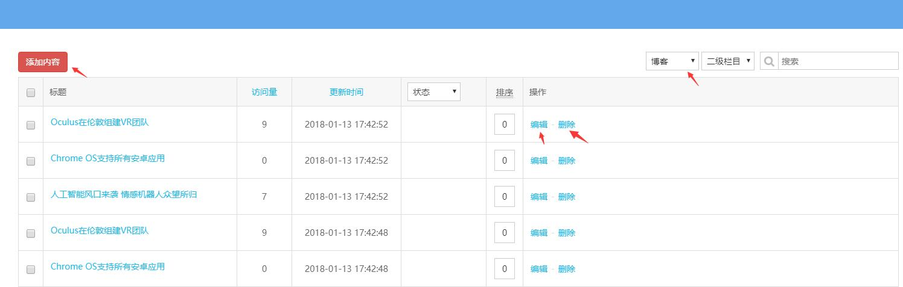
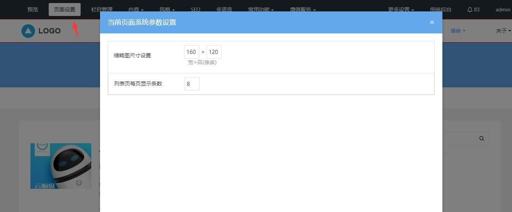
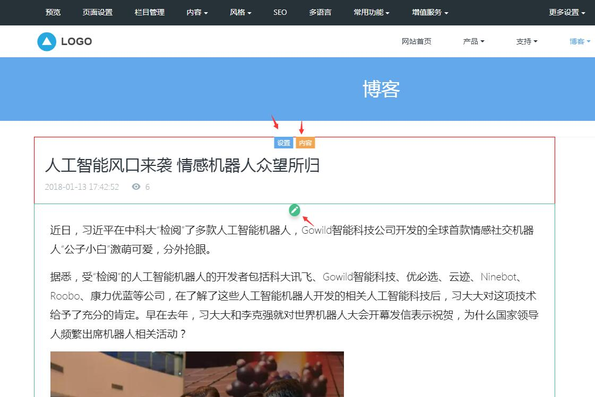
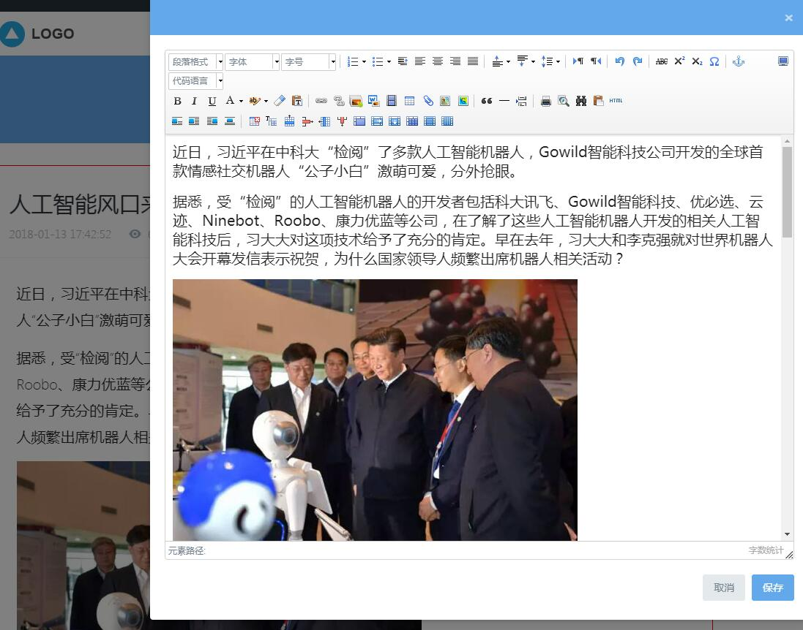
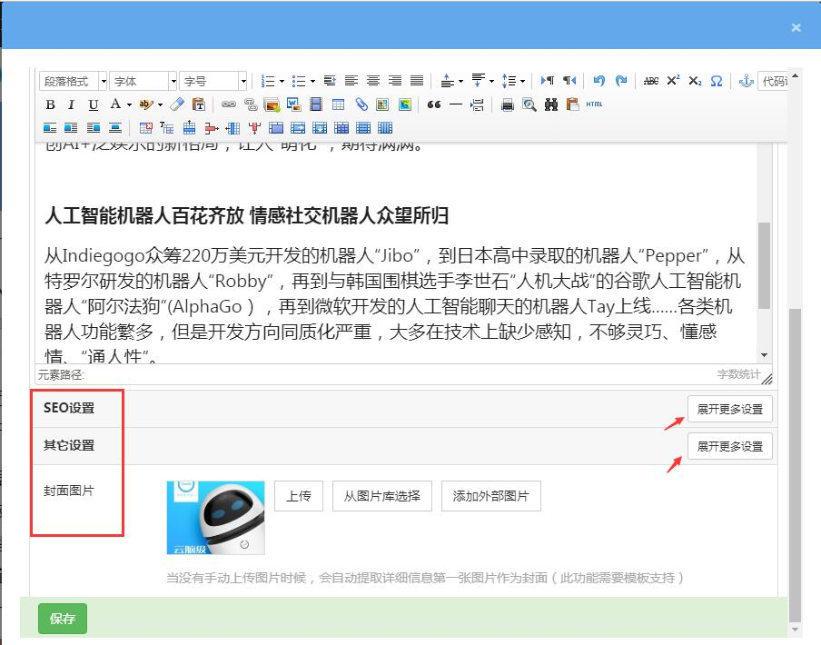

# 6、新闻页修改

**一、新闻列表页设置**

点击所属模块是新闻模块的栏目（可通过栏目管理添加），进入的是新闻列表页，新闻列表页展示的是新闻模块下的新闻内容列表。

**1、快速修改新闻列表页内容**

图片和文字信息都可以直接可视化修改，鼠标放在需要修改的地方，可直接点击可视化修改图标，即可修改替换成自己的内容。

设置：不同模板的新闻列表页展示风格是不一样的，所以对应的设置中的选项也不一样，通过区块的设置按钮，可以设置当前区块的风格色调，区块开关等。

内容：点击内容按钮，进入的是当前栏目模块的内容管理界面，可添加发布更多内容，或编辑，删除当前内容，具体可参考内容管理。

**2、新闻列表页页面设置**

可视化编辑功能区块的页面设置按钮，不同的模块的页面设置是不一样的，新闻列表页的页面设置，可设置当前新闻列表页产品缩略图尺寸和每页显示的新闻条数。

**二、新闻详情页设置**

点击新闻列表页的单个新闻列表，可进入新闻详情，展示的是该条新闻的详细信息。

设置：修改区块的展示样式，区块开关、风格色调等，不同模板的新闻详情页设置的功能是不一样的，具体以当前模板的设置为准。

内容：点击内容按钮，进入的是当前新闻的内容编辑页面，可编辑修改当前新闻详细信息，具体可参考添加内容。

点击内容区块的可视化修改图标，可以快速修改正文内容；

点击区块的内容按钮，可修改整篇文章的所有内容（包括标题，所属栏目、SEO等）

