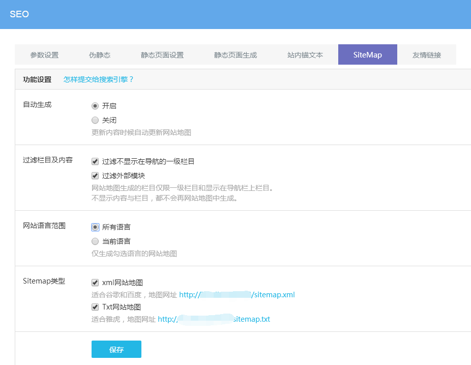

# Sitemap 设置

**如何生成网站地图（Sitemap）**

## **网站地图 Sitemap 的定义**

网站地图，又称站点地图，它就是一个页面，上面放置了网站上需要搜索引擎抓取的所有页面的链接（注：不是所有页面）。大多数人在网站上找不到自己所需要的信息时，可能会将网站地图作为一种补救措施。搜索引擎蜘蛛非常喜欢网站地图。

## **如何设置网站地图**

可视化编辑后台 — SEO — Sitemap 中设置

**自动生成：**开启后网站内容更新后自动更新网站地图，建议设置开启。

**过滤栏目及内容：**可以过滤不在网站前台显示的栏目或外部栏目。（网站地图生成的栏目仅限一级栏目和显示在导航栏上栏目。不显示内容与栏目，都不会再网站地图中生成。）

**网站语言：**选择所有语言或者当前语言。

**SiteMap类型：**勾选后，会在站点目录下生成对应格式的文件，sitemap.xml 或 sitemap.txt。

网站地图sidemap开启后，可以到各站长平台手动提交给搜索引擎，更有利于搜索引擎爬行和抓取