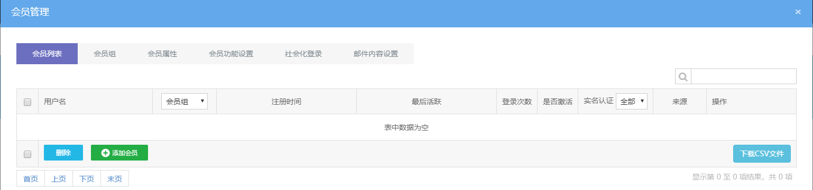
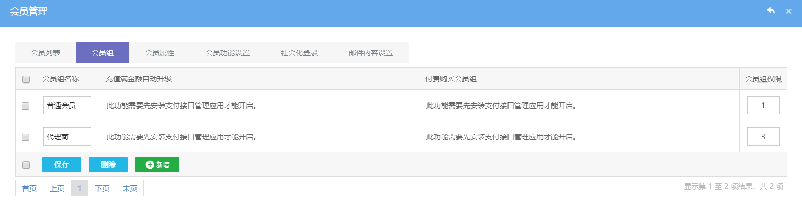
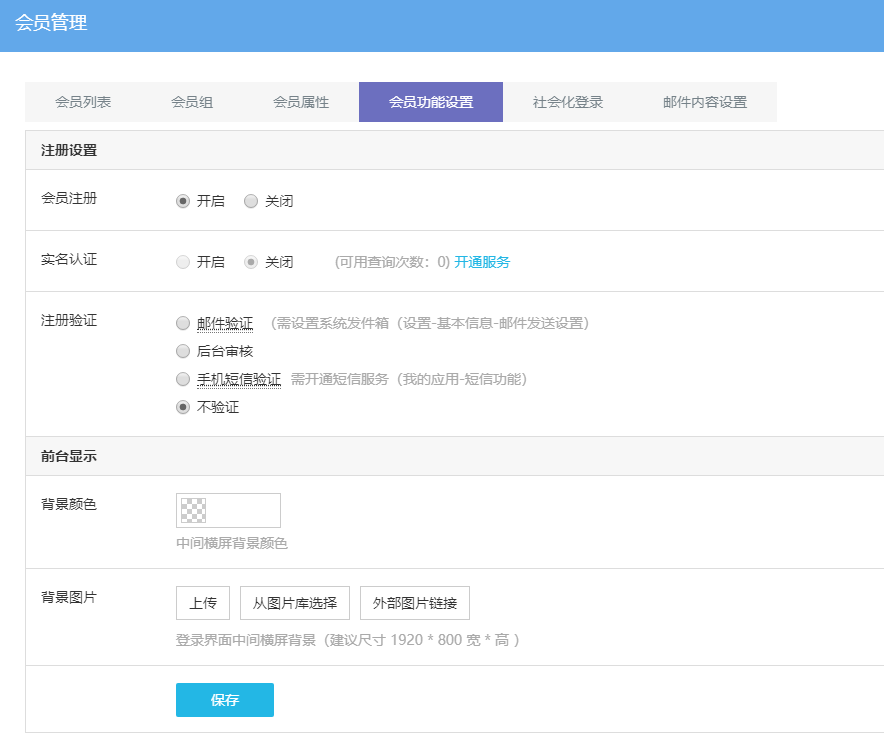
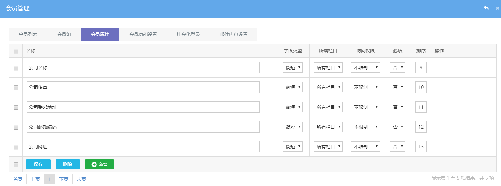
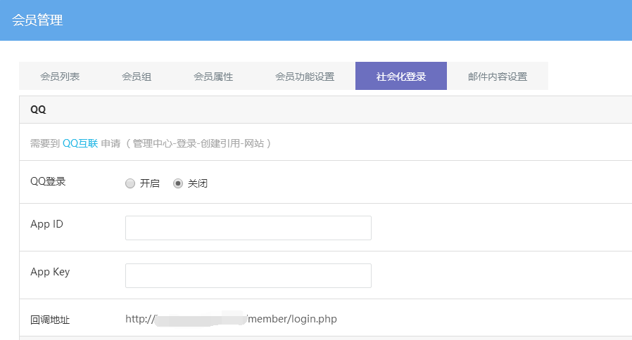
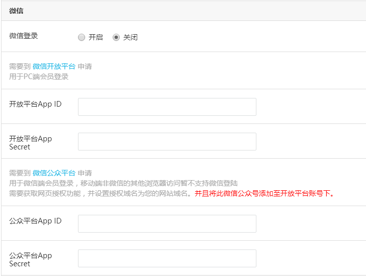

# 会员管理

**系统的会员模块功能齐全，可自定义设置登陆注册方式，会员分组及权限管理。**

**一、如何开启会员登陆注册功能**

**1、视频教程：**

**2、文档教程：**

在可视化编辑后台 — 常用功能 — 会员管理中操作。

网站用户信息管理功能，可以在页面前台注册会员账号，或者在网站后台通过管理员添加管理会员，也可导出会员信息。

## **二、会员分组设置**

**会员升级：**可以搭配支付接口应用，在线充值或购买提升会员分组。

**会员组权限：**可以添加任意多个分组，阅读权限值设置越大，阅读权限越高；
低权限分组中会员可以查看到的网站内容，高权限分组都可以查看到。

## **三、会员注册**

**1、设置会员功能**

**会员注册：**开启或关闭会员注册功能，关闭后，首页不会显示注册登录按钮。

**实名认证：**需要充值短信费用才能开通。

**注册验证：**设置会员注册功能开启或关闭，并设置会员注册验证类型，分为邮箱验证（注册时填写邮箱账号）、后台审核、手机短信验证（注册时填写手机号码）或不验证方式。

**背景颜色和图片：**系统默认有张背景图片，如果删除了默认的背景图片且没有上传背景图片，则背景颜色设置才会显示。

**2、设置会员属性**

会员注册时填写的表单信息

**名称：**注册会员时需提交的信息。

**字段类型：**根据填写的内容选择对应的字段类型，电话或邮箱字段类型会进行输入格式判断。

**所属栏目：**一个语言只能添加一个会员模块栏目，所以无需设置此项。

**访问权限：** 此功能暂时无效。

**必填：**设置字段是否必填，选择「是」后，前台必须填写才能提交表单。

**排序：**字段在前台显示的顺序，数值越小越靠前。

**操作：**字段类型为下拉、多选、单选类型时需要点击操作中的设置选项按钮，填写选项值，否则字段内容为空。

## **四、社会化登录**

米拓建站系统会员中心还支持QQ、微信、微博等快速登录方式。

QQ社会化登录，需要到 [QQ互联](https://connect.qq.com/) 创建网站引用通过后，获取对应的 ID 和 Key 值填写到此处。

微信社会化登录，分为电脑端登录和微信端登录（且只支持微信浏览器打开），需要到对应平台申请通过后，获取对应平台的AppID和AppSecret值，PC端到[微信开放平台](https://open.weixin.qq.com/cgi-bin/frame?t=home/web_tmpl&lang=zh_CN)申请创建应用，微信端到[微信公众平台](https://mp.weixin.qq.com/)设置，并且需要将此微信公众添加至开放平台账号下。

## **五、会员邮件内容设置**

邮件内容包含注册验证邮件、找回会员密码邮件、修改绑定邮箱邮件，内容可直接采用系统自带，不建议自行修改。

