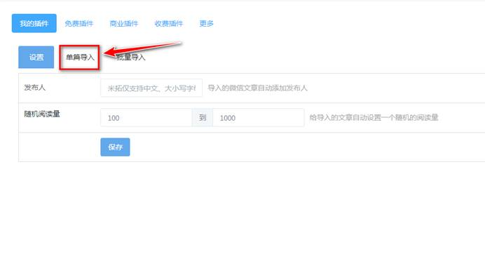
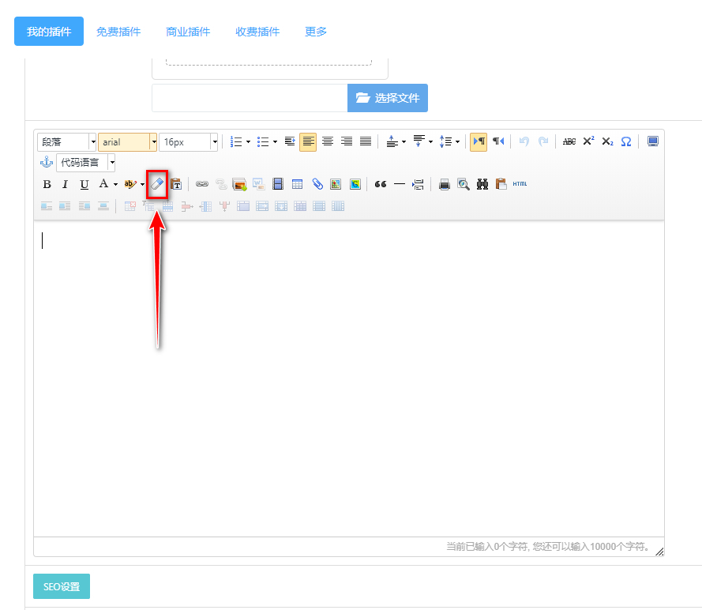

# 微信一键导入文章

**在后台界面点击“传统后台”**

****

**进入后在左侧选择“应用插件”**

****

**进入插件列表后，在列表中找到“一键导入微信文章”**

****

**点击“单篇导入”**

****

**在文章链接处粘贴微信公众号的链接，点击获取内容后文章会自动生成，选择要发布文章的栏目，如新闻中心-医院新闻 ，如封面图显示不正确可收到上传封面图，最好在最下方点击保存就可发布成功。**

****

**获取微信公众号文章链接方法如下：**

**登录微信电脑版，找到需要发布的文章并打开**

**在弹出的文章中点击如下图所示按钮，则复制该文章的链接成功。**

****

如果内容为空，则在编辑器中选择清除样式按钮！

 