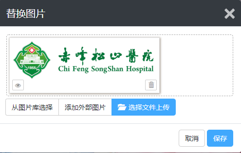

# 1、功能按钮介绍

可视化编辑即网页上可见的内容，都可以直接点击编辑修改，主要分为区块编辑和内容编辑。

**一、区块可视化编辑**

鼠标放在需要修改的区块，会出现设置和内容功能按钮

**设置：**区块的相关设置，可开启或隐藏区块，设置区块调用的栏目内容，以及区块的展示方式等，不同区块的设置选项是不同的，具体以使用的模板为准。

**内容：**不同页面的内容按钮，可编辑管理的内容权限是不一样的，从首页区块点击进入的内容，则可以管理编辑所有栏目模块的内容，列表页的内容按钮则只能管理编辑当前栏目模块的内容，详情页的内容按钮，则只能编辑当前页面显示的内容。

**二、内容可视化编辑**

**2.1、可视化编辑图片**

鼠标放在需要修改的图片上，点击修改图标，可直接更换图片

支持本地上传，从图片库中选择，还可以直接用外部网站上的图片

注意：添加外部图片时，需外部图片未设置防盗链，否则无法添加成功。

**2.2、可视化编辑文字内容**

鼠标放在需要修改的文字内容区块，会出现内容或修改图标，点击修改图标，可以快速修改正文内容

点击内容，可以修改整篇文章的所有设置（包括标题，所属栏目、SEO等）

